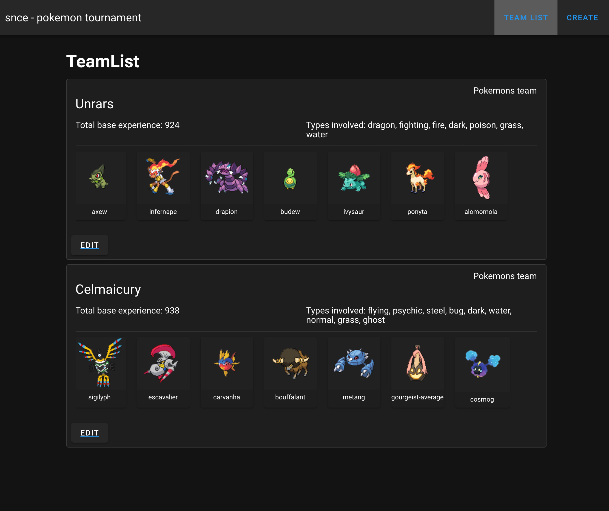

# pokemon 

## frontend setup
```
cd frontend
npm i 
npm run build
```

## backend setup
```
cd backend
npm i 
npm run build
```


## Launch application 
```
make docker_up

or

docker-compose -f docker-compose.yml up 

```
 go to http://tet.snce.it:8080 or http://127.0.0.1:8080 


### Test
```
docker exec -it snce-backend npm run test
```



